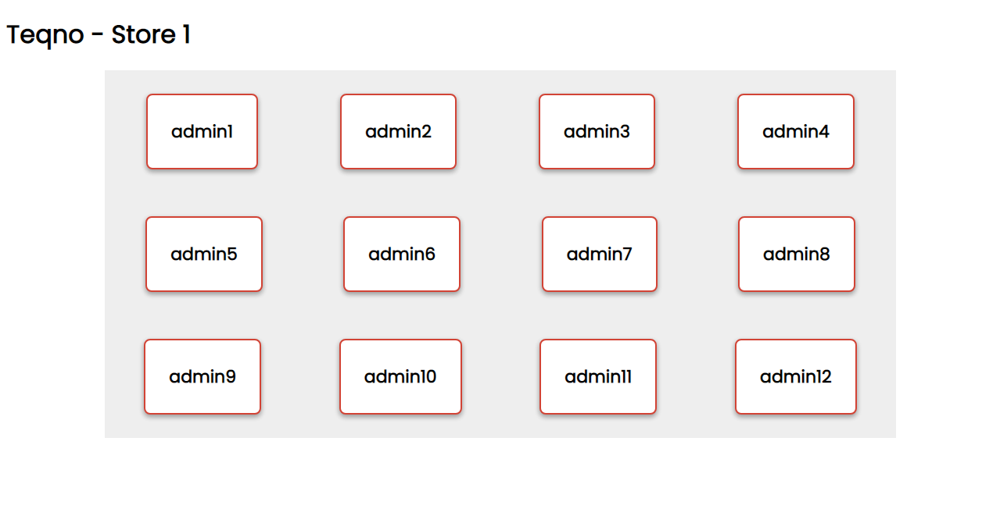
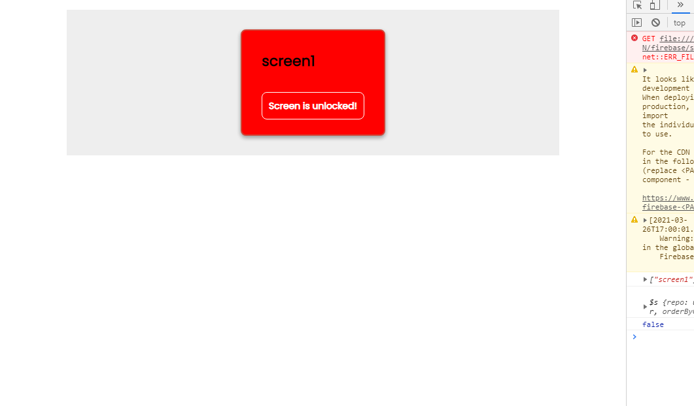

This is our how our data is structured.

This is all admin screens

This is specific admin's screen

the screen color changes accordingly 

+ if screen is unlocked color will be green
+ if screen is locked color will be red

there will be errors if you found some then pls open issues.

will update......